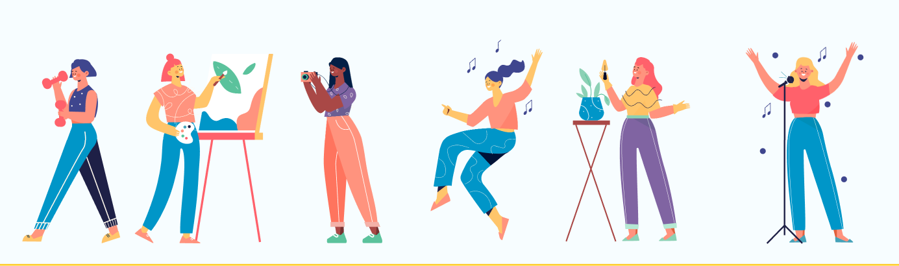

<!DOCTYPE html>
<head>
    <meta charset="utf-8">
    <meta name="viewport" content="width=device-width, initial-scale=1, shrink-to-fit=no">

    <link rel="stylesheet" href="https://cdn.jsdelivr.net/npm/bootstrap@4.0.0/dist/css/bootstrap.min.css" integrity="sha384-Gn5384xqQ1aoWXA+058RXPxPg6fy4IWvTNh0E263XmFcJlSAwiGgFAW/dAiS6JXm" crossorigin="anonymous">
    <link rel="preconnect" href="https://fonts.googleapis.com">
<link rel="preconnect" href="https://fonts.gstatic.com" crossorigin>
<link href="https://fonts.googleapis.com/css2?family=Roboto:wght@300&display=swap" rel="stylesheet">

    <title>hobbycue</title>
    <link rel="stylesheet" href="style.css">

</head>
<body>

  <!--Navbar-->
  <nav class="navbar navbar-expand-lg navbar-light bg-light">
    <a class="navbar-brand" href="#"><i style="color: #3f78d9; margin-left: 140px;">hobby</i><i style="color: #a468df;">cue</i> 
Your Hobby, Your Communtiy
</a>
    
    <form class="d-flex">
      <input class="form-control " type="search" placeholder="Search" aria-label="Search" style="border-color: #b1caf7; margin-left: 140px; border-top-left-radius: 10px; border-bottom-left-radius: 10px;">
      

      <i class="fa-solid fa-magnifying-glass" style="color: #ffffff;"></i>
    

    </form>

    <button class="navbar-toggler" type="button" data-toggle="collapse" data-target="#navbarScroll" aria-controls="navbarScroll" aria-expanded="false" aria-label="Toggle navigation">
      
    </button>
    

      <ul class="navbar-nav mr-auto my-2 my-lg-0 navbar-nav-scroll" style="max-height: 100px;">
       
        <li class="nav-item dropdown" style="margin-left: 80px;">
          <a class="nav-link dropdown-toggle" href="#" role="button" data-toggle="dropdown" aria-expanded="false"><i class="fa-solid fa-compass" style="color: #a468df;"></i>
           <b> Explore</b>
          </a>
          <ul class="dropdown-menu">
            <li><a class="dropdown-item" href="#">Action</a></li>
            <li><a class="dropdown-item" href="#">Another action</a></li>
            <li>
</li>
            <li><a class="dropdown-item" href="#">Something else here</a></li>
          </ul>
        </li>
        <li class="nav-item dropdown" style="margin-left: 30px;">
          <a class="nav-link dropdown-toggle" href="#" role="button" data-toggle="dropdown" aria-expanded="false"><i class="fa-solid fa-star" style="color: #a468df; ;"></i></i>
           <b> Hobbies</b>
          </a>
          <ul class="dropdown-menu">
            <li><a class="dropdown-item" href="#">Action</a></li>
            <li><a class="dropdown-item" href="#">Another action</a></li>
            <li>
</li>
            <li><a class="dropdown-item" href="#">Something else here</a></li>
          </ul>
        </li>
        <li class="nav-item " style="margin-left: 80px;">
          <i class="fa-solid fa-bookmark" style="color: #a468df;"></i>
        </li>
        <li class="nav-item" style="margin-left: 80px;">
          <i class="fa-solid fa-bell" style="color: #a468df;"></i></li>
          <li class="nav-item" style="margin-left: 80px;"><i class="fa-solid fa-cart-shopping" style="color: #a468df;"></i></li>

          <li class="nav-item " style="margin-left: 80px;">
            <button type="button" class="btn btn-square btn-sm " style="border-color: #a468df;  width: 110px; height: 40px; border-radius: 10px;"> Sign In </button>
          </li>
        
      </ul>
      
    

  </nav>
   <!-- Section: Design Block -->
<section class="">
   <!-- Jumbotron -->
   

     

       

         

           
             Explore Your 
             hobby
             or
             passion
           
           

             Sign-in to interact with a community of fellow hobbyists and an eco-system of experts, teachers, suppliers, classes,workshops, and places to practice, participate or perform. Your hobby may be about visual or performing arts, sports, games, gardening, model making, cooking, indoor or outdoor activities... 
             if you are an expert or a seller, you can Add your Listening and promote yourself, your students, products, servicce or events. Hop on your hobbyhorse and enjoy the ride
           

         

 
         

             

               <form>
                

                <!--signin form-->
                
                

                  
                  <button type="button" class="btn btn-block text-dark" style="border-color: #AF9FC9;">
                   <i class="fa-brands fa-google" style="color: #c44e27;"></i> Continue with Google
                  </button>

                  
                  <button type="button" class="btn btn-block text-dark mt-2" style="border-color: #C5B4E3;">
                   <i class="fa-brands fa-facebook"></i> Continue with Facebook
                  </button>
                 

                 
<b>or connect with</b>

                 <!-- Email input -->
                 

                   <input type="email" id="form3Example3" class="form-control" placeholder="email" />
                 

 
                 <!-- Password input -->
                 

                   <i><input type="password" id="form3Example4" class="form-control" placeholder="password"/></i>
                 

 
                 <!-- Checkbox -->
                 

                  

                    <!-- Checkbox -->
                    

                      <input class="form-check-input" type="checkbox" value="" id="form2Example31" />
                      <label class="form-check-label" for="form2Example31"> Remember me </label>
                    

                  

              
                  

                    <!-- Simple link -->
                    
<i class="fa-solid fa-lock" style="color: #C5B4E3;"></i>  Forgot password?

                  

                

              

                 

                   
By continuing, you agree to our <b>Terms of Service</b> and <b>Privacy Policy</b>

                 

 
                 <!-- Submit button -->
                 
                 <button type="submit" class="btn btn-block mb-4 " style="background-color:#C5B4E3 ; color: beige; " >
                   Agree and  Continue
                 </button>
                
                 <!-- Register buttons -->
                 
               </form>
           

         
           

         

       

       

   
  

      

     

   

   <!-- Jumbotron -->
   <!--card section 1-->
   
 
    
 
        
 
            
 
                 

                
 
                  <h5> <i class=" fa-solid fa-users "></i>  People</h5> 
                    
 
                       Find a teacher, coach, or expert for your hobby interest in your locality. Find a partner, teammate, accompanist or collaborator. 
                    
 

                    <button type="submit" class="btn btn-outline " style="border-color: #C5B4E3;">
                      connect 
                    </button>
                
 
            
 
        
 
        
 
            
 
                
                
 
                    <h5><i class="fa-solid fa-location-dot" style="color: #1e600b;"></i>    Place</h5> 
                    
 
                      Find a class, school, playground, auditorium, studio, shop or an event venue. Book a slot a venues that allow booking through hoobycue.
                    
 
                      
                    <button type="submit" class="btn btn-outline btn-sm" style="border-color:#C5B4E3 ;"> Meet up
               </button>
                
 
            
 
        
 
    
 

 
            
    <!--card section 2-->

 
        
 
            
 
                
 
                    
 
                        <h5><i class="fa-solid fa-bag-shopping" style="color: #9c0707;"></i>  Product</h5> 
                        
 
                            Find equipment or supplies required for your hobby. Buy,rent or borrow from shops,online stores or from community members
                        
 
                        <button type="submit" class="btn btn-outline btn-sm" style="border-color: #C5B4E3;"> 
                             Get it
                        </button> 
                        
                    
 
                
 
            
 
            
 
                
 
                    
 
                        <h5><i class="fa-solid fa-calendar-check" style="color: #3f78d9;"></i>  Program</h5> 
                        
 
                            Find events, meetups and workshops related to your hobby. Register or buy tickets online. 
                        
 
                          
                        <button type="submit" class="btn btn-outline btn-sm " style="border-color:#C5B4E3 ;"> 
                            Attend
                        </button> 
                    
 
                
 
            
 
        
 
    

    <!-- single card-->
    

    

      

        <h4><i class="fa-solid fa-circle-plus" style="color: #3e77da;"></i>  Add your own</h4>
        
 Are you a teacher or expert? Do you sell or rent out equipment, venue or even ticket? or, you know someone who should be on hobbycue? Go ahead and Add Your Own page

        <button type="submit" class="btn btn-outline btn-sm" style="border-color: #C5B4E3;">Add new</button>
        
      

    

  

  <!-- Testimonials block-->
  
  

    <h4><i class="fa-solid fa-quote-left" style="color: #ba9bd9;"></i>  Testimonials</h4>
    
 In a fast growing and ever changing city like Bangalore, it sometimes becomes very difficult to find or connect with like minded people. Website like hobbycue.com is a great service which helps me get in touch with, communicate, connect and exchange ideas with other dancers. It also provide the extra benefit of finding products and service that I can avail, which I can be assured is going to be of great quality as it comes recommended by people of hobbycue community. To have discussion, to get visibility, and to be able to safely explore various hobbies and activities inmy city, all under one roof, is an excellent idea and I highly recommend it. 

  

  <!--another block-->
  

    <h4 style="font-size: xx-large;">Your
      hobby
      ,Your
      Community
    </h4>
    <button type="submit"  class="btn  btn-sm " style="background-color: #a468df; color: beige ; width: 150px; border-radius: 10px; height: 40pt; font-size: medium;">Get Started</button>
    

  

  <!-- Footer -->
<footer class="text-center text-lg-start bg-body-tertiary text-muted">
 

  <!-- Section: Links  -->
  <section class="">
    

      <!-- Grid row -->
      

        <!-- Grid column -->
        

          <!-- Content -->
          <h6 class="text-uppercase fw-bold mb-4">
            <i class="fas fa-gem me-3"></i>Hobbycue
          </h6>
          

           About Us
          

          

            Our Services
          

          

            Work with Us
          

          

            FAQ
          

          

            Contact Us
          

        

        <!-- Grid column -->

        <!-- Grid column -->
        

          <!-- Links -->
          <h6 class="text-uppercase fw-bold mb-4">
           How Do I
          </h6>
          

            Sign Up
          

          

            Add a Listing
          

          

           Claim Listing
          

          

           Post a Query
          

          

            Add a Blog post
          

          

            Other Queries
          

        

        <!-- Grid column -->

        <!-- Grid column -->
        

          <!-- Links -->
          <h6 class="text-uppercase fw-bold mb-4">
           Quick Links
          </h6>
          

            Listining
          

          

           Blog Posts
          

          

           Shop / Store
          

          

            Community
          

        

        <!-- Grid column -->

        <!-- Grid column -->
        

          <!-- Links -->
          <h6 class="text-uppercase fw-bold mb-4">Social Media</h6>
          

            <i class="fa-brands fa-facebook" style="color: #b0c8f2; padding-right: 10px;"></i>

            <i class="fa-brands fa-square-twitter" style="color: #b3c2ff; padding-right: 10px;"></i>

            <i class="fa-brands fa-square-instagram" style="color: #b1c8f2; padding-right: 10px;"></i>
            
            <i class="fa-brands fa-pinterest" style="color: #b2cbf5; padding-right: 10px;"></i>

            <i class="fa-brands fa-google-plus" style="color: #b1caf7; padding-right: 10px;"></i>

            <i class="fa-brands fa-youtube" style="color: #b2c7eb; padding-right: 10px;"></i>

            <i class="fa-brands fa-telegram" style="color: #b1c8f2; padding-right: 10px;"></i>

            <i class="fa-solid fa-envelope" style="color: #b0caf7; margin-bottom: 30px;"></i>

            <!--end of icons-->
            <h6 style="text-align: left;"> Invite Friends</h6>

            

              <input class="form-control my-0 py-1 " type="text" style="border-color: #a468df;" placeholder="Email id" aria-label="Email id">
              

                 Invite
              

            

          

        

        <!-- Grid column -->
      

      <!-- Grid row -->
    

  </section>
  <!-- Section: Links  -->

  <!-- Copyright -->
  

    © Purple Cues Private Limited:
    
  

  <!-- Copyright -->
</footer>
<!-- Footer -->

 </section>
 <!-- Section: Design Block -->
   

</body>
</html>
